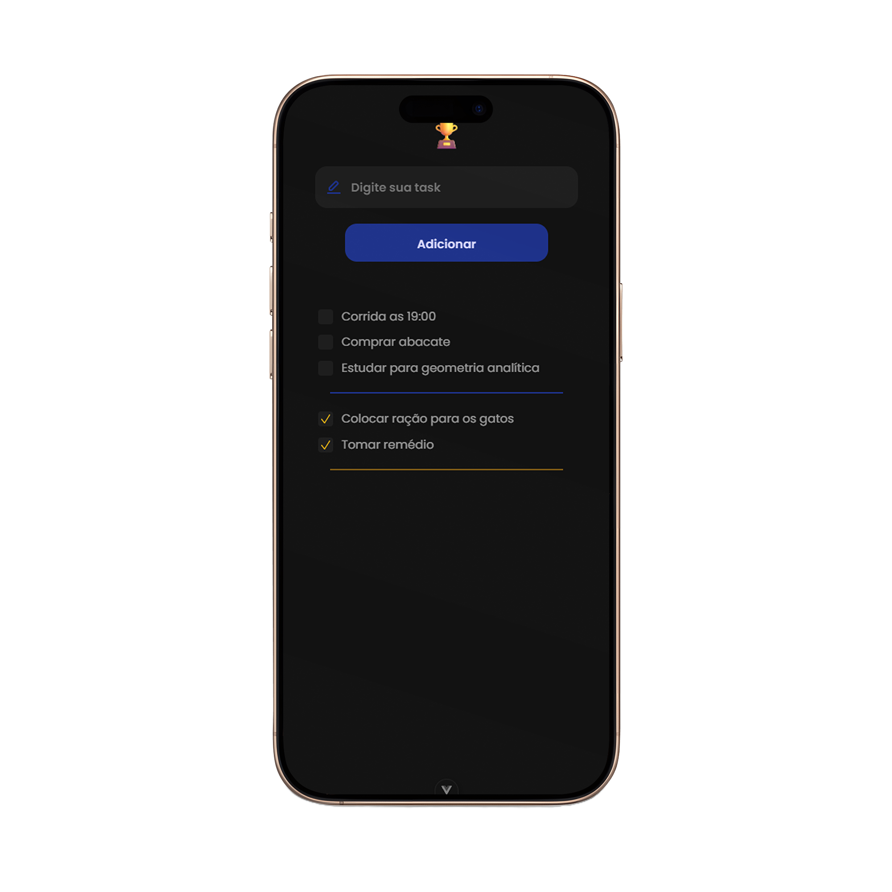

# To-Do List 📝 




### ✨ Descrição

Este é um projeto de um app de lista de tarefas (To-Do List) puramente fron-end desenvolvida com Vue.js. 

### 🎨 Design e Prototipagem

O design e a prototipagem deste aplicativo foram realizados no **Figma**. 


- **Link do Protótipo**: [Figma](https://www.figma.com/design/EMk3eCSlDEUyiNPiHpAkGP/To-do-List?node-id=0-1&p=f&t=oEWCvcqgNxLtTM6T-0) 

### 📌 Versão

Esta é a **Versão 1.0 (v1.0)** do aplicativo To-Do List. Nesta versão inicial, as funcionalidades implementadas incluem:

✔️ Cadastro de tarefas. <br>
✔️ Marcação de tarefas como concluídas. <br>
✔️ Listagem de todas as tarefas cadastradas. <br>

### 🛠️ Tecnologias Utilizadas

     

### ▶️ Como Executar Localmente
Instale as dependências

```sh
npm install
```

Inicie o servidor

```sh
npm run dev
```

###  Próximas Atualizações 

- Integração com banco de dados para persistência de dados. <br>
- Desenvolvimento de uma API <br>
- Adição de autenticação de usuários. <br>
- Implementação de filtros e ordenação de tarefas. <br>